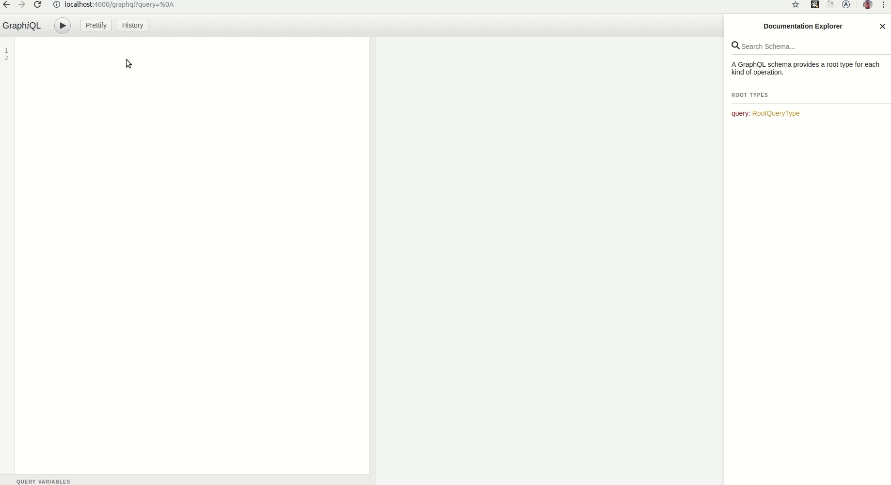

# graphql-middleware
My test using express to graphql server

This is just to understand evaluate a node middleware option.

Just clone and install nodemon 
```npm i nodemon -g```

Then you can just run ```nodemon app``` and continuos changing and reloading automatically

Just go to ```localhost:4000/graphql``` and try it out.

